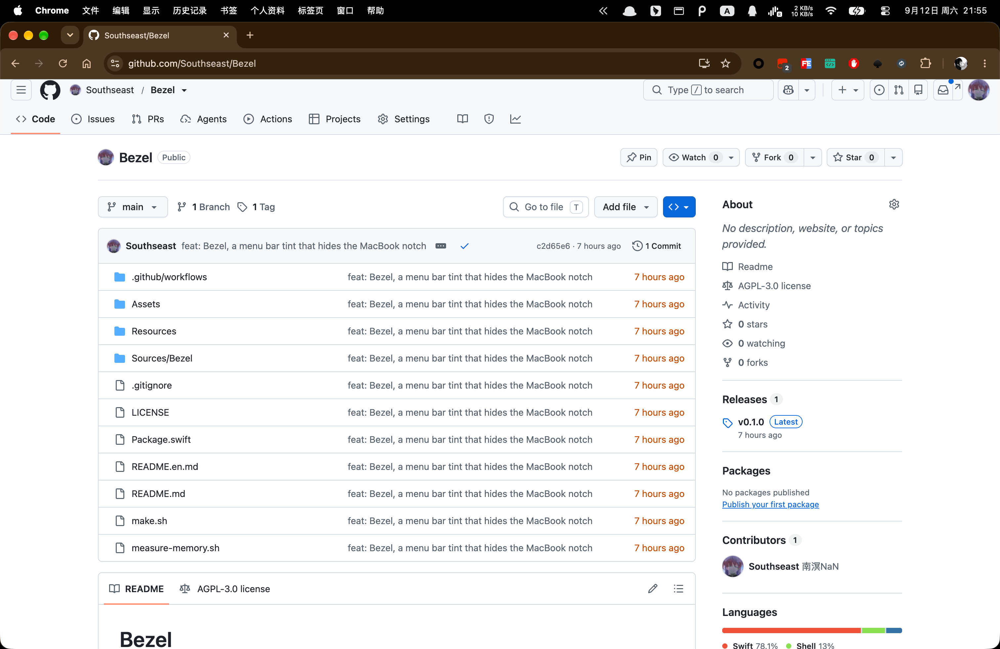
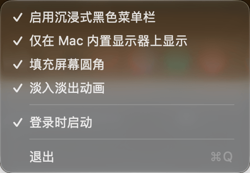

# Bezel

[English](README.en.md) | 简体中文



把刘海"融入"菜单栏的 macOS 小工具:在系统菜单栏下方垫一条通栏纯黑色条带,菜单栏的半透明材质会采样到纯黑,整条菜单栏变黑,刘海看起来就是屏幕边框(bezel)的一部分。

## 为什么做这个

[TopNotch](https://topnotch.app/) 在新版 macOS 上已经无法使用,于是自己重写了一个。与 TopNotch 改写桌面壁纸的方案不同,Bezel 用一个垫在菜单栏下方的覆盖窗口实现同样的效果:**不修改壁纸、即开即关、退出即恢复、纯公开 API**。

## 功能

- 菜单栏通栏纯黑,刘海无缝衔接(刘海屏自动按真实刘海高度补齐)
- 跨桌面空间常驻,多显示器支持(可选仅 Mac 内置显示器)
- 后台常驻:屏幕插拔、设置变化自动同步
- 可选:填充屏幕四角的圆角空隙(贴合应用窗口圆角)
- 可选:淡入淡出动画
- 全屏应用时自动隐藏(全屏空间没有菜单栏可染色)
- 登录时启动(SMAppService)
- 中 / 英双语界面,跟随系统语言

## 已知限制

- Cmd+Tab 切换桌面时,过渡动画期间黑条会短暂消失(约 0.3 秒)——WindowServer 对浮层窗口的固有行为,公开 API 无法避免。
- macOS 26 的应用窗口圆角尺寸不一致,"填充屏幕圆角"在部分窗口角落可能出现细微缝隙;macOS 27 已实测无此问题。

## 构建与运行

```bash
./make.sh
open build/Bezel.app
```

要求 macOS 14+,Swift 5.9+。应用为菜单栏程序(无 Dock 图标):

- **点击菜单栏图标**(左键/右键均可):直接弹出菜单,所有设置都在菜单里
- 可勾选项:启用、仅内置显示器、填充圆角、淡入淡出、登录时启动
- 无独立设置窗口,点选即生效



## 版本与发版

- 版本号由 git tag 驱动:打上 `v` 前缀的 tag(如 `git tag v0.2.0`)后重新 `./make.sh`,版本自动写入应用;未打 tag 时构建为 `0.1.0-dev` 带提交哈希
- `./make.sh zip` 生成 `dist/Bezel-<版本>.zip` 发布包
- 仓库推送到 GitHub 后,推送 `v*` tag 会由 GitHub Actions 自动构建并在 Releases 挂出 zip(见 `.github/workflows/release.yml`)
- 分发提示:应用为 ad-hoc 签名,他人下载后首次打开需右键 → 打开,或执行 `xattr -cr /path/to/Bezel.app`

## 实现说明

- 每块目标屏一个全屏透明 `NSPanel`,窗口层级 `.mainMenu - 1`(垫在菜单栏下、所有应用窗口上),`ignoresMouseEvents` 鼠标穿透。
- 内存开销很小:黑条窗口约占 6 MB(实测),应用整体常驻约 21 MB。可用 `./measure-memory.sh` 复现该数据(自动 A/B 实测并恢复原设置)。
- 屏幕插拔、设置变更都会触发重建/回收;关闭功能时窗口淡出后彻底关闭,不留驻留窗口。
- 替换 `Assets/Bezel.png` 后运行 `python3 Assets/build-icns.py` 可重新生成应用图标(无损优化打包)。
